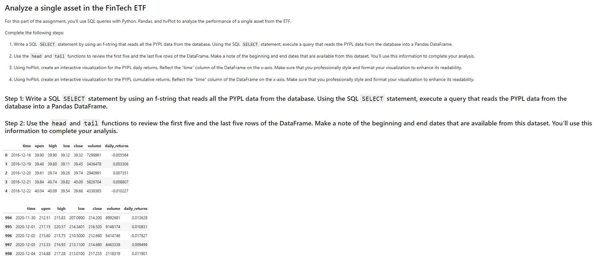
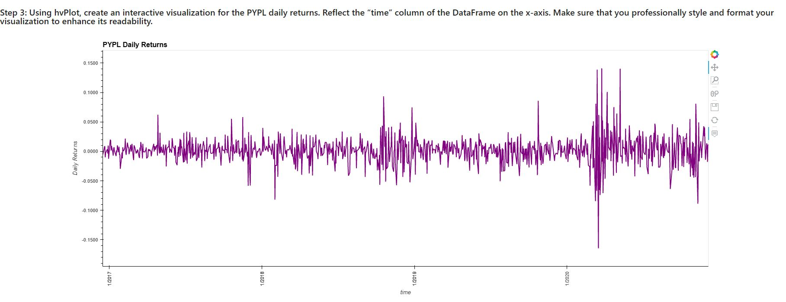
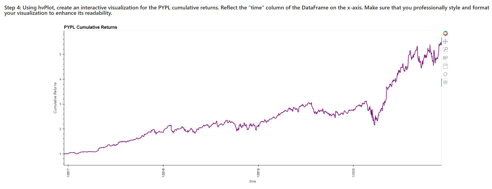
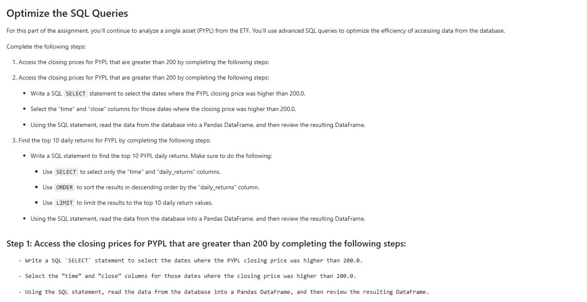
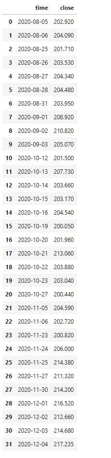
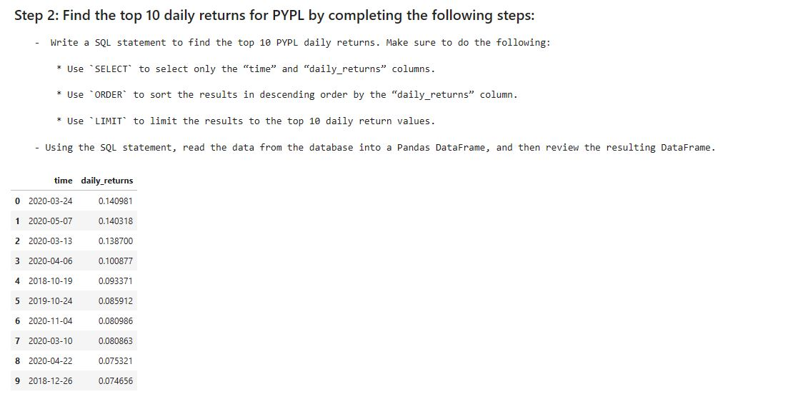
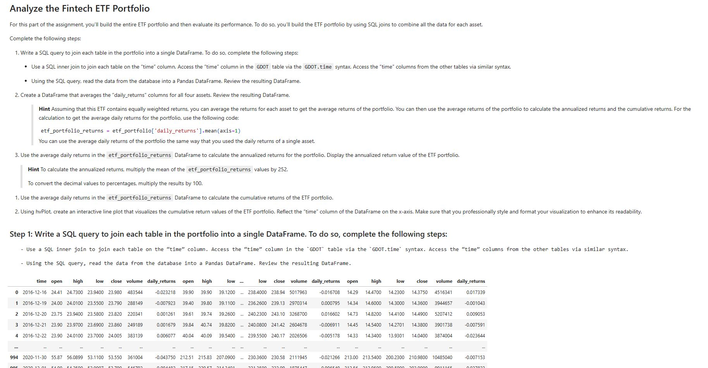
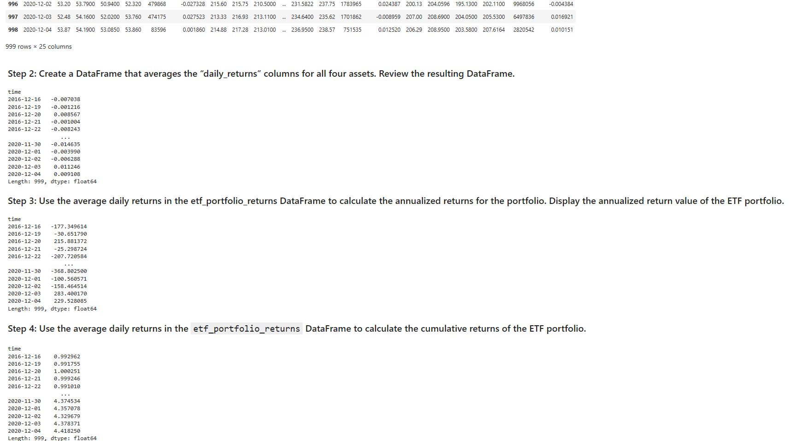
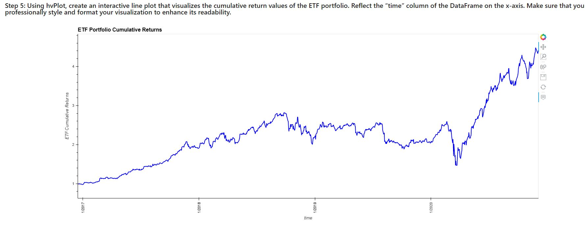

# An exchange-traded fund (ETF) Analyzer
This is an  exploratory data analysis (EDA) which deploys data visualization skills, including aggregation, interactive visualizations, and geospatial (that is, location-based) analysis. The ultimate goal is to identify the patterns and relationships in the data  to be used to find properties in the San Francisco market that are viable investment opportunities.

This is an analysis of ETF data stored in SQL database to establish the performance of a hypothetical fintech ETF that consists of four stocks. The analysis is presented through professionally styled and formatted interactive visualizations and a screenshot of the web application that I created by deploying my Jupyter notebook via the Voilà library. 

## Methodology and Approach

Used SQL queries with Python, Pandas, and hvPlot to analyze the performance of a single asset from the ETF

Used advanced SQL queries to optimize the efficiency of accessing data from the database.

Built the ETF portfolio by using SQL joins to combine all the data for each asset and then evaluated its performance.

## Libraries and Technologies Used

- Pandas library -  a Python library for data analysis. 

- hvPlot - visualization library. 

-  Voilà library - to deploy the Juypter library as a web application

- Jupyter notebook

## ETF financial application deployed to the web
Below are the screenshots of the ETF financial application deployed as a web application:

---

